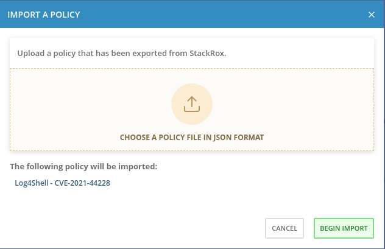
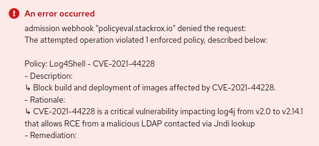
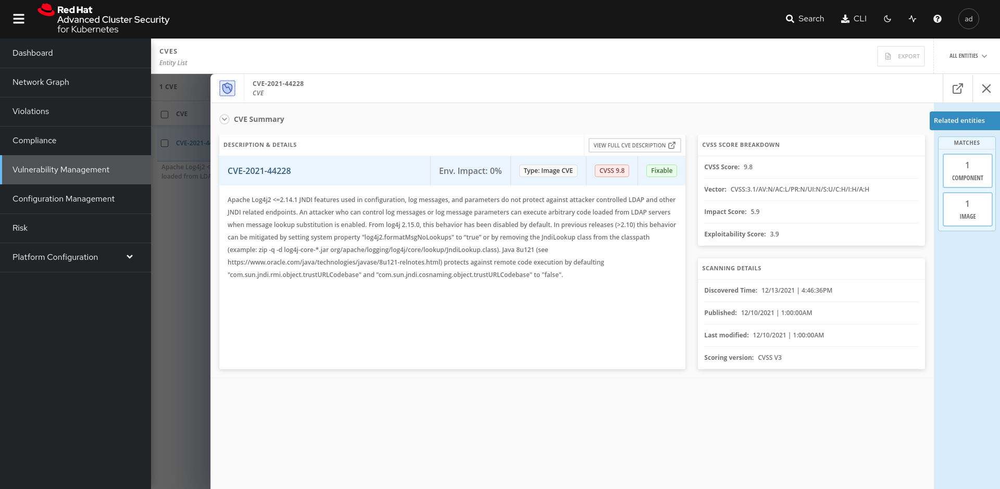

# RHACS Log4Shell mitigation example

A policy-based mitigation example for CVE-2021-44228 on Red Hat Advanced Cluster Security for Kubernetes.
The policy works on both build and deployment stages.
More information about the vulnerability on the Red Hat Security Bulletin [RHSB-2021-009](https://access.redhat.com/security/vulnerabilities/RHSB-2021-009).


### How to use this example
Create a new policy on RHACS to detect the images and components affected by the CVE and 
trigger enforcement actions upon build and deploy.

To create the new policy import the policy configuration file `acs-log4shell-policy.json`. The policy 
is alreay configured to enforce both build and deployment stages.  



  

Create a vulnerable deployment using image `quay.io/gbsalinetti/log4shell-vulnerable-app`, based on 
the [log4shell-vulnerable-app](https://github.com/christophetd/log4shell-vulnerable-app) example
by christophetd.
The application is a simple Spring Boot basic example that embeds log4j pacakge to print activity logs.

To create the deployment in the target cluster:

```
$ kubectl create -f log4shell-deployment.yaml
```

On RHACS this should produce an immediate action that prevents the deployment to be completed by scaling down
the expected replicas to 0.

```
$ oc describe deployment log4shell -n log4shell-rogue-ns
[...omitted output...]
Events:
  Type     Reason                Age   From                   Message
  ----     ------                ----  ----                   -------
  Warning  StackRox enforcement  5s    stackrox/sensor        Deployment violated StackRox policy "Log4Shell - CVE-2021-44228" and was scaled down
  Normal   ScalingReplicaSet     5s    deployment-controller  Scaled up replica set log4shell-f6d896fdd to 3
  Normal   ScalingReplicaSet     5s    deployment-controller  Scaled down replica set log4shell-f6d896fdd to 0
```

From the OpenShift Developer Console, a deployment creation will trigger the following output, enriched with rationale and remediation messages:  

.


Looking at the RHACS console we can find detailed informations about the discovered vulnerability:



**IMPORTANT**: The policy only affects new deployments and builds. Pre-existing deployments are not eradicated by default and should be mitigated by 
upgrading the underlying image or applying a proper mitigation like disabling Jndi lookup.

### Bypassing the admission controller
For emergency deployments, it is possible to bypass the admission controller by adding the `admission.stackrox.io/break-glass` annotation to the deployment YAML. It is recommended to use this features with caution.
For more informations about the break-glass feature check out the following [article](https://access.redhat.com/articles/5897721) from Red Hat knowledge base.
